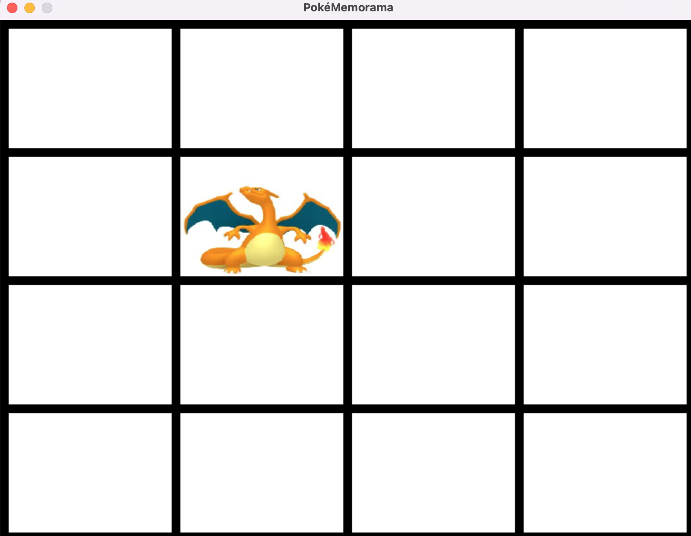

# Proyecto: Memorama Pokémon con Python y Pygame

Este proyecto es un juego de Memorama (Memory Match) en el que los jugadores deben emparejar cartas con imágenes de Pokémon. El juego está desarrollado en Python y utiliza la biblioteca Pygame para la interfaz gráfica y la lógica del juego.

## Requisitos

- Python 3.9
- Pygame (instalable con `pip install -r requirements.txt`)

## Instrucciones

1. Clona este repositorio o descarga los archivos.
2. Asegúrate de tener Python instalado.
3. Instala la biblioteca Pygame si aún no lo has hecho: `pip install pygame`.
4. Ejecuta el juego: `python main.py`.

## Características

- Juego de Memorama con imágenes de Pokémon.
- Programado en Python utilizando el paradigma orientado a objetos.
- Interfaz gráfica implementada con Pygame.
- Empleo de conceptos como clases, eventos y lógica de juego.

## Capturas de Pantalla

## Licencia

Este proyecto está bajo la Licencia MIT - consulta el archivo [LICENSE](LICENSE) para más detalles.
